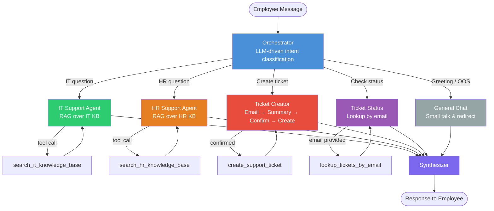

# SmartDesk AI — Intelligent IT & HR Support Agent

An intelligent multi-agent help desk system built with **LangGraph** and **OpenAI** that serves as a first-line IT and HR support agent for NovaTech Solutions (fictional 500-employee SaaS company).

## What It Does

SmartDesk AI handles three core capabilities:

1. **Knowledge Base Query (RAG)** — Answers employee questions from curated IT and HR knowledge bases using retrieval-augmented generation with confidence scoring.
2. **Ticket Creation (Write)** — When the KB cannot answer a question, the agent offers to create a support ticket with human-in-the-loop confirmation.
3. **Ticket Status Check (Read)** — Employees can check the status of previously raised tickets by providing their email.

## Architecture



```
                          ┌──────────────────┐
                          │  Employee Message │
                          └────────┬─────────┘
                                   │
                          ┌────────▼─────────┐
                          │   Orchestrator    │  ← LLM classifies intent
                          │ (structured output│    (no hardcoded if/else)
                          │  + Send API)      │
                          └────────┬─────────┘
                                   │
              ┌────────────┬───────┼───────┬─────────────┐
              │            │       │       │             │
        ┌─────▼────┐ ┌────▼───┐ ┌─▼──────┐ ┌───▼──────┐ ┌──▼───────┐
        │IT Support│ │  HR    │ │ Ticket │ │ Ticket   │ │ General  │
        │  Agent   │ │Support │ │Creator │ │ Status   │ │  Chat    │
        │  (RAG)   │ │ (RAG)  │ │ (HITL) │ │ (Lookup) │ │          │
        └────┬─┬───┘ └───┬─┬─┘ └──┬─┬───┘ └───┬─┬────┘ └────┬─────┘
             │ │        │ │      │ │         │ │            │
             │ ▼        │ ▼      │ ▼         │ ▼            │
             │ IT KB    │HR KB   │ Mock      │ Mock         │
             │ Search   │Search  │ Create    │ Lookup       │
             │ │        │ │      │ │         │ │            │
             └─┘        └─┘     └─┘         └─┘            │
              │          │        │           │             │
              └──────────┴────────┴───────────┴─────────────┘
                                   │
                          ┌────────▼─────────┐
                          │   Synthesizer    │  ← Merges parallel results
                          └────────┬─────────┘
                                   │
                          ┌────────▼─────────┐
                          │     Response     │
                          └──────────────────┘
```

## Key Design Decisions

| Decision | Approach | Why |
|---|---|---|
| **Routing** | LLM with `with_structured_output()` | Every routing decision is made by the LLM — zero hardcoded if/else |
| **Parallelism** | LangGraph `Send` API | Queries spanning IT + HR run agents concurrently |
| **RAG** | OpenAI embeddings + in-memory cosine similarity | Self-contained; swap for ChromaDB/Pinecone in prod |
| **Confidence** | Retrieval-score threshold + LLM self-assessment | Dual-layer: vector similarity score + LLM prompt instruction |
| **Escalation** | Agent suggests ticket creation when confidence is low | Natural conversation flow — no forced escalation |
| **HITL** | LLM-managed confirmation flow | Agent collects email → presents summary → waits for confirmation → creates |
| **Session memory** | `InMemorySaver` checkpointer + `employee_email` in state | Email and context persist across conversation turns |
| **Ticket mock** | In-memory list with `seed_demo_tickets()` | Swap for Jira/Asana/Notion API in production |

## Project Structure

```
hr_it_support/
├── main.py                    # Interactive CLI (multi-turn REPL)
├── app.py                     # Streamlit UI (multi-conversation)
├── requirements.txt
├── .env.example
├── README.md
│
├── config/
│   └── settings.py            # Models, paths, thresholds, API keys
│
├── state/
│   └── state.py               # Graph state + Pydantic routing schemas
│
├── agents/
│   ├── orchestrator.py        # LLM-driven routing + Send API dispatch
│   ├── it_support.py          # IT RAG agent + confidence escalation
│   ├── hr_support.py          # HR RAG agent + confidence escalation
│   ├── ticket_create.py       # Ticket creation with HITL confirmation
│   ├── ticket_status.py       # Ticket lookup by email
│   ├── general_chat.py        # Greetings, small talk, out-of-scope
│   └── synthesizer.py         # Merges parallel agent outputs
│
├── tools/
│   ├── kb_search.py           # RAG search tools (IT + HR) with scores
│   └── ticket_ops.py          # Create ticket + lookup by email (mock)
│
├── graph/
│   └── workflow.py            # Full graph assembly & compilation
│
├── data/
│   ├── it_knowledge.json      # 17 IT support articles
│   └── hr_policies.json       # 27 HR policy articles
│
└── utils/
    └── vector_store.py        # In-memory vector store + OpenAI embeddings
```

## Knowledge Base

**44 articles** across 4 domains with deliberate gaps for testing escalation:

| Domain | Articles | Example Topics |
|---|---|---|
| IT Support | 17 | Password reset, VPN, MFA, software, hardware, email, Wi-Fi, security, printers, accounts |
| HR Policies | 10 | Leave (CL/SL/EL/maternity/comp-off), WFH policy, code of conduct, anti-harassment |
| Onboarding | 5 | Day-1 checklist, laptop/equipment, benefits enrolment, buddy programme, probation |
| Payroll & Comp | 5 | Payday, tax declaration, salary structure, ESOP vesting, offboarding |
| Benefits | 4 | Health insurance, PF/401k, EAP, wellness programme |

**Deliberate gaps** (should trigger escalation): monitor flickering, office parking, cafeteria menu, desk/chair ergonomic requests, specific software bugs, building access card issues.

## Getting Started

### Prerequisites

- Python 3.11+
- OpenAI API key with access to `gpt-5.5` (or adjust in `config/settings.py`)

### Installation

```bash
git clone <repo-url>
cd hr_it_support

python -m venv venv
source venv/bin/activate   # Windows: venv\Scripts\activate

pip install -r requirements.txt

cp .env.example .env
# Edit .env and add: OPENAI_API_KEY=sk-your-key-here
```

### Run

SmartDesk AI ships with two front-ends — pick whichever fits your workflow.
Both use the same compiled LangGraph under the hood.

#### Option 1 — Terminal (CLI REPL)

```bash
python main.py
```

CLI commands inside the REPL:

| Command  | What it does                                          |
| -------- | ----------------------------------------------------- |
| *(any)*  | Ask SmartDesk AI a question                           |
| `tickets`| List every ticket created in this session             |
| `new`    | Start a fresh conversation thread                     |
| `quit`   | Exit                                                  |

#### Option 2 — Streamlit (multi-conversation web UI)

```bash
streamlit run app.py
```

Opens at <http://localhost:8501>. Features:

- **Sidebar conversation switcher** — start a new chat, switch between
  ongoing chats, or delete one. Each chat keeps its own thread in the
  LangGraph checkpointer, so context (employee email, ticket flow, ongoing
  topic) is fully isolated per conversation.
- **Multi-window** — open additional browser tabs for fully independent
  parallel sessions; the cached graph is shared but state is per-tab.
- **Live ticket viewer** — sidebar expander lists every ticket with
  status colour and assignee email.
- **Per-message routing breakdown** — expandable "🔍 Routing details"
  under each assistant reply showing which agent(s) handled the turn.

> **Logs:** Every routing decision, tool call, confidence score, and agent
> timing is `print`-ed by [`utils/logger.py`](utils/logger.py) — they stream
> to the terminal where you launched `streamlit run`. Keep that window
> visible alongside the browser to watch the graph execute live.

### Environment Variables

| Variable | Description | Required |
|---|---|---|
| `OPENAI_API_KEY` | Your OpenAI API key | Yes |

## Sample Conversations

### Flow A — KB Answer (IT)

```
👤 You: How do I reset my password?

🤖 SmartDesk:
To reset your NovaTech password (ref: IT-001):
1. Visit https://passwords.novatech.com
2. Click "Forgot Password"
3. Enter your employee ID (format: NT-XXXXX)
4. Verify via OTP sent to your registered mobile/email
5. Create a new password (min 14 chars, with uppercase, lowercase,
   digit, and special character)

Passwords expire every 90 days. If locked out after 5 failed attempts,
wait 30 minutes or call IT Help Desk at ext. 2020.

Is there anything else I can help with?
```

### Flow B — KB Answer (HR)

```
👤 You: How many sick leaves do I get per year?

🤖 SmartDesk:
NovaTech provides 8 sick leaves per calendar year (ref: HR-002).
Key details: ...
```

### Flow C — Escalation → Ticket Creation

```
👤 You: My monitor has been flickering for two days.

🤖 SmartDesk:
I'm sorry to hear about the monitor issue. Unfortunately, I don't have
a troubleshooting guide for monitor flickering in our knowledge base.
I can create a support ticket for the IT team to assist you.

Would you like me to create a ticket? If so, could you share your email?

👤 You: Yes, jane.doe@novatech.com

🤖 SmartDesk:
Thanks, Jane. Here's the ticket I'll create:

• Title: Monitor Flickering Issue
• Description: Employee reports monitor has been flickering for 2 days.
• Category: IT
• Priority: Medium
• Email: jane.doe@novatech.com

Shall I go ahead and create this?

👤 You: Yes, please.

🤖 SmartDesk:
✅ Ticket TKT-A3F2B1 has been created successfully!
Track it by asking me for updates anytime. Is there anything else?
```

### Flow D — Ticket Status Check

```
👤 You: What's the status of my tickets?

🤖 SmartDesk:
Sure! Could you share your email address?

👤 You: jane.doe@novatech.com

🤖 SmartDesk:
I found 2 tickets for jane.doe@novatech.com:

1. TKT-DEMO01 | Monitor Flickering — Status: In Progress
   💬 IT team: "Replacement monitor ordered, expected delivery by Thursday."

2. TKT-DEMO02 | Reimbursement Pending — Status: Open
   No updates yet.

Would you like more details on either ticket?
```

## Extending the System

### Connect a Real Ticketing Platform

Replace the mock in `tools/ticket_ops.py`:

```python
# Jira example
from jira import JIRA

jira = JIRA(server="https://your-domain.atlassian.net", basic_auth=(email, token))

@tool
def create_support_ticket(...) -> str:
    issue = jira.create_issue(
        project="SUPPORT",
        summary=title,
        description=description,
        issuetype={"name": "Task"},
    )
    return json.dumps({"ticket_id": issue.key, ...})
```

### Switch to Production Persistence

```python
# In graph/workflow.py:
from langgraph.checkpoint.postgres import PostgresSaver
checkpointer = PostgresSaver.from_conn_string(DB_URI)
```

### Add a Different Web UI

The Streamlit front-end in [`app.py`](app.py) is a thin wrapper over
`build_graph()` + `graph.invoke()`. Drop in Gradio, Chainlit, FastAPI, or
your own framework by importing the same two pieces — the graph is fully
decoupled from the UI.

## Capstone Coverage

| Requirement | Status | Implementation |
|---|---|---|
| RAG Pipeline (25 marks) | ✅ | Dual KB (IT+HR), OpenAI embeddings, confidence scoring, escalation |
| Ticket Creation (20 marks) | ✅ | Email collection, HITL confirmation, post-creation feedback |
| Ticket Status (15 marks) | ✅ | Lookup by email, multi-ticket listing, no-ticket handling |
| Orchestration (15 marks) | ✅ | LLM routing, multi-turn context, out-of-scope handling |
| Code Quality (15 marks) | ✅ | Modular structure, README, architecture diagram |
| Error Handling (10 marks) | ✅ | Graceful errors, no hardcoded secrets, edge cases |
| **Bonus**: Multi-agent | ✅ | Separate IT + HR sub-agents with parallel dispatch |
| **Bonus**: 44-article KB | ✅ | Both domains, deliberate gaps, structured format |

## License

MIT
